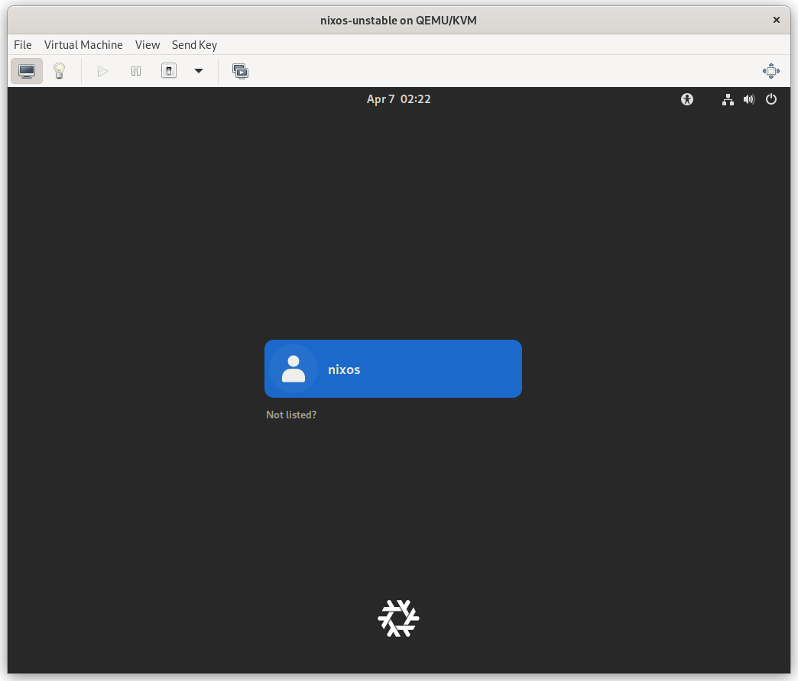
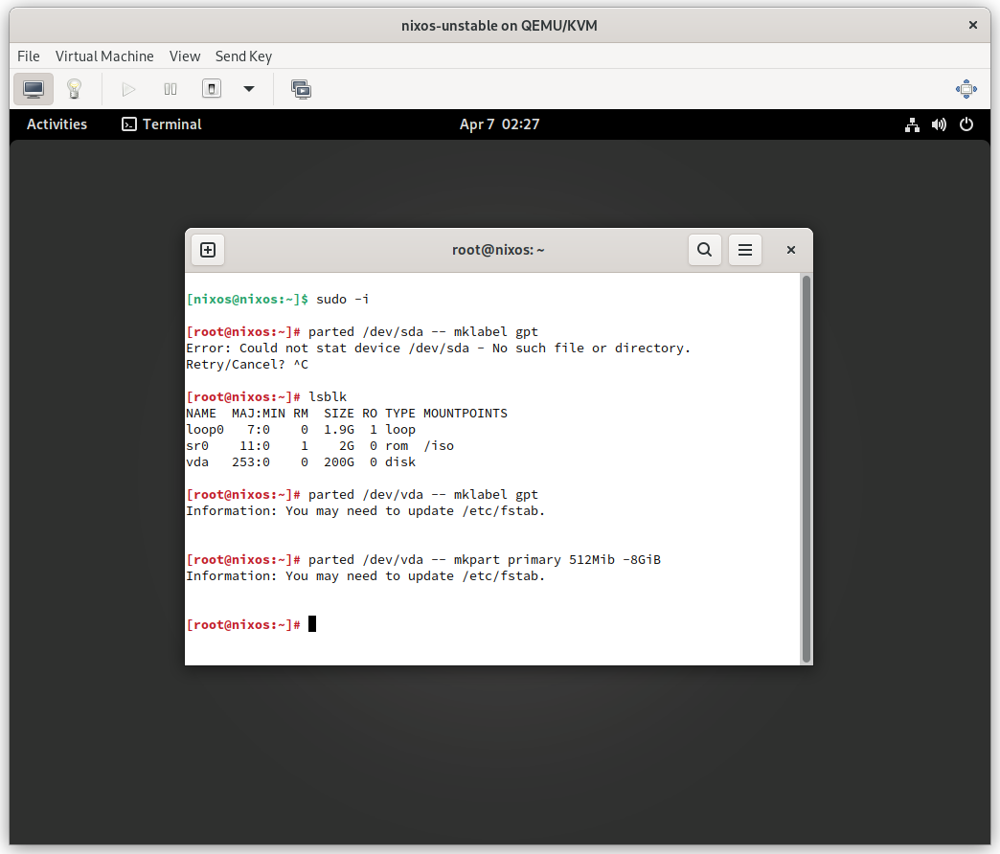
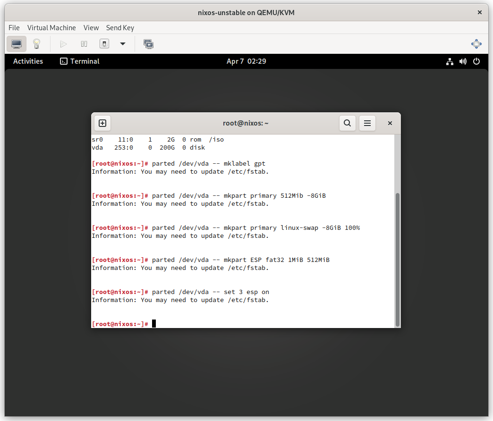
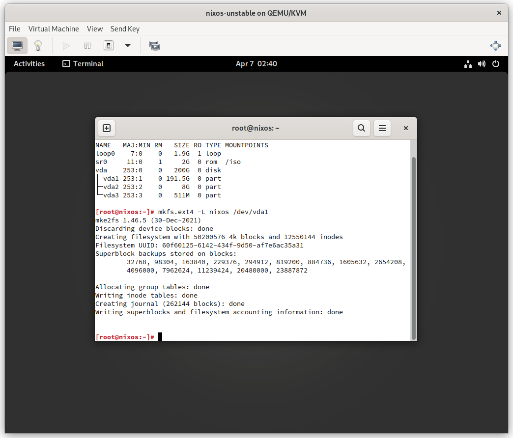
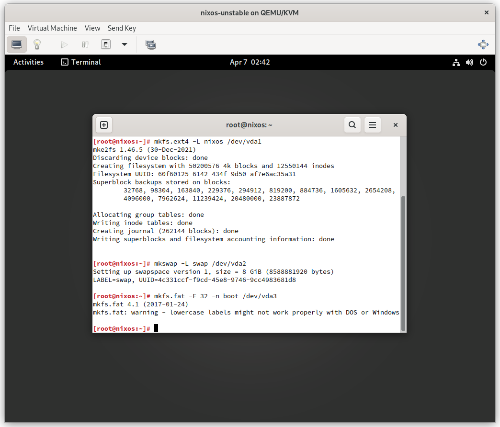
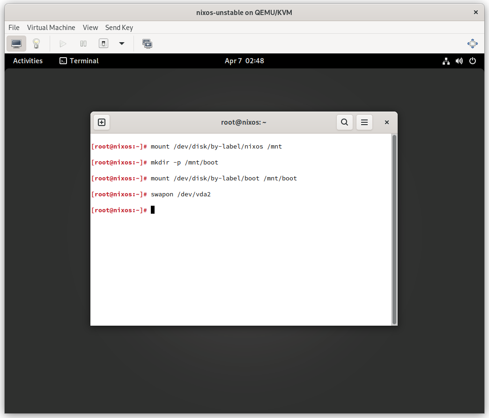
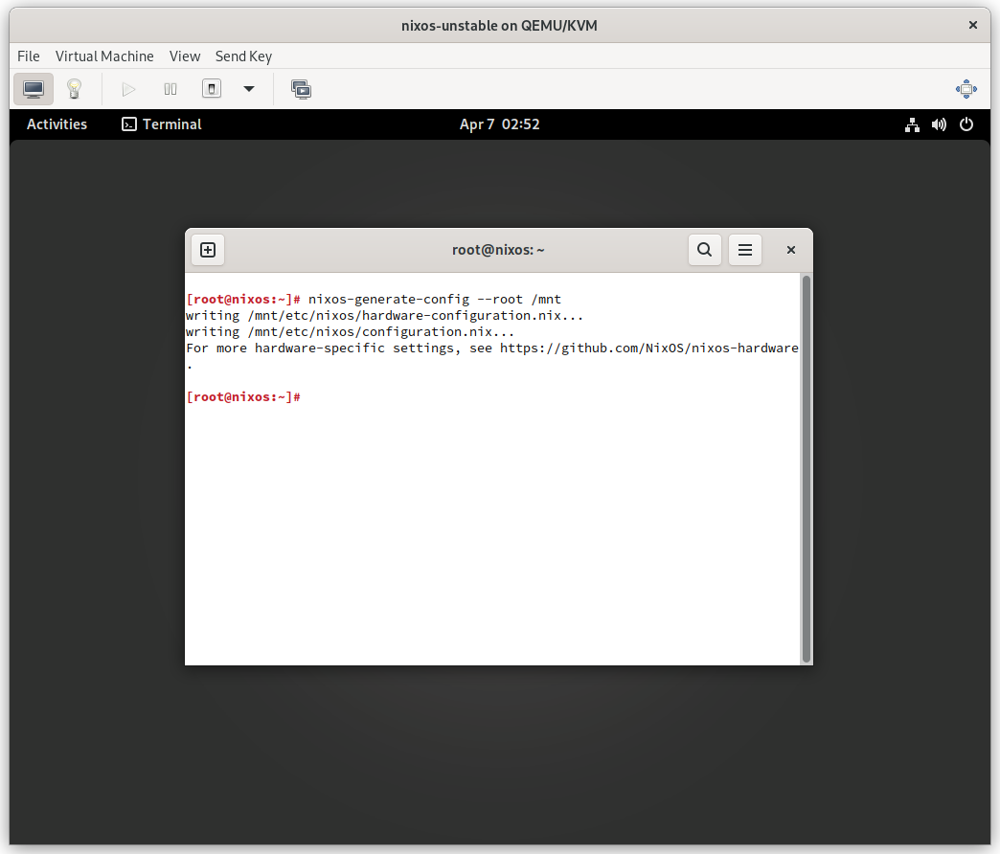
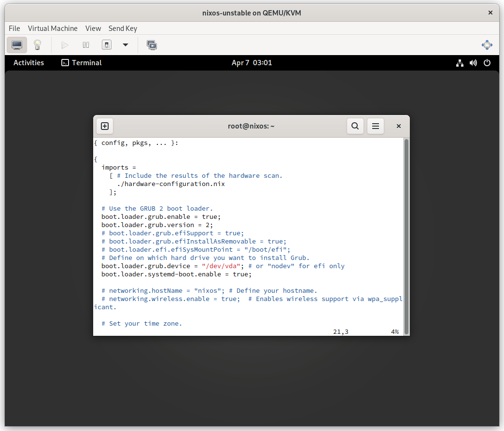
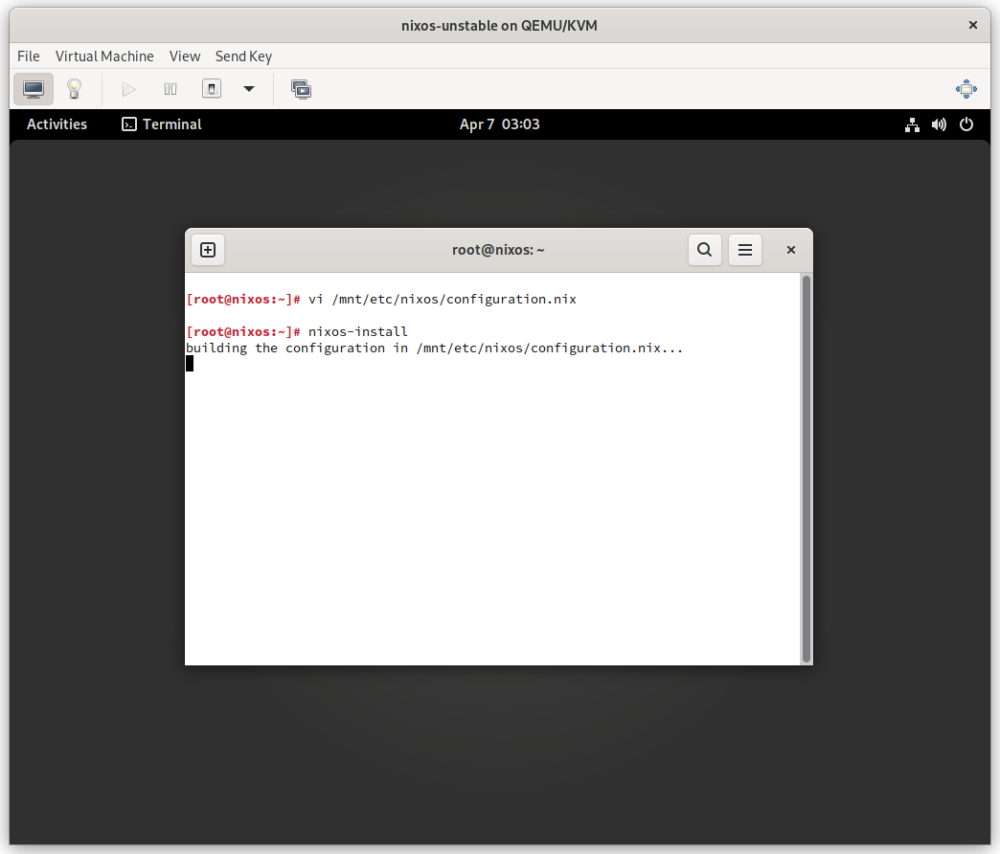

# Download NixOS
https://channels.nixos.org/nixos-21.11/latest-nixos-gnome-x86_64-linux.iso


# Install NixOS





```sh
sudo -i
parted /dev/vda -- mklabel gpt
parted /dev/vda -- mkpart primary 512MiB -8GiB
parted /dev/vda -- mkpart primary linux-swap -8GiB 100%
parted /dev/vda -- mkpart ESP fat32 1MiB 512MiB
parted /dev/vda -- set 3 esp on
```



```sh
mkfs.ext4 -L nixos /dev/vda1
mkswap -L swap /dev/vda2
mkfs.fat -F 32 -n boot /dev/vda3
```


```sh
mkdir -p /mnt/boot
mount /dev/disk/by-label/boot /mnt/boot
swapon /dev/vda2
```




