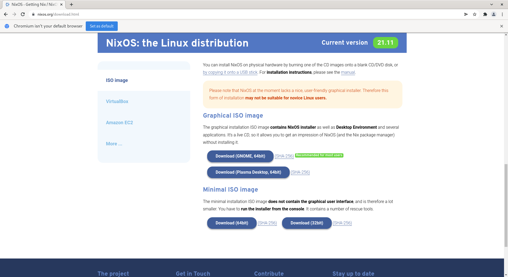
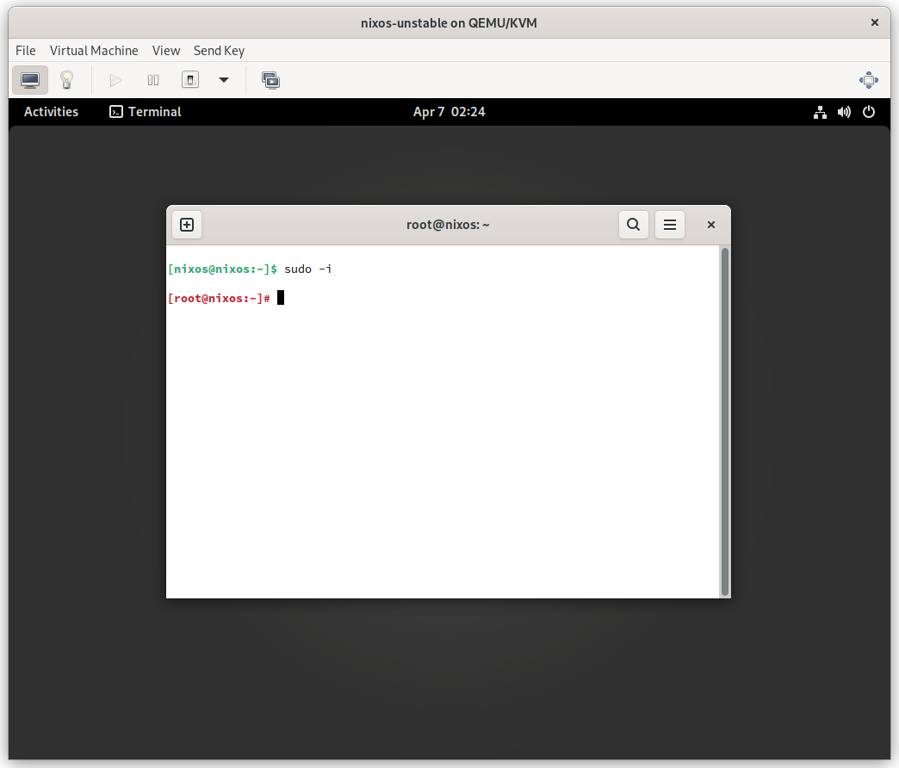

# Download NixOS
https://channels.nixos.org/nixos-21.11/latest-nixos-gnome-x86_64-linux.iso



# Install NixOS




```sh
sudo -i
parted /dev/vda -- mklabel gpt
parted /dev/vda -- mkpart primary 512MiB -8GiB
parted /dev/vda -- mkpart primary linux-swap -8GiB 100%
parted /dev/vda -- mkpart ESP fat32 1MiB 512MiB
parted /dev/vda -- set 3 esp on
```

